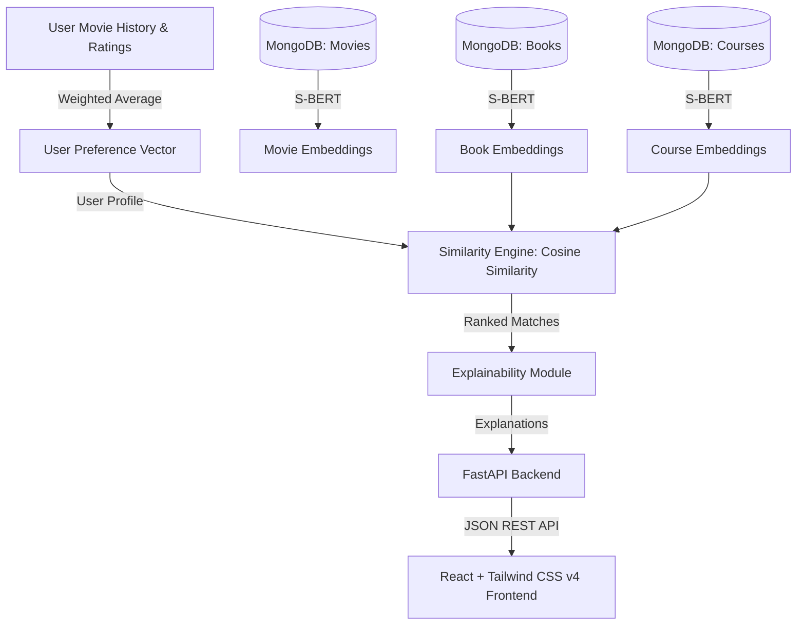

# Cross-Domain Recommendation System (Movies ➔ Books ➔ Courses)

An advanced, end-to-end recommendation engine that transfers user preferences from the entertainment domain (Movies) to target domains (Books and Courses) using semantic similarity, natural language processing, and deep learning.

---

## 🌌 Project Overview
Traditional recommendation systems operate in silos (e.g., Netflix recommends movies, Goodreads recommends books, Coursera recommends courses). However, user interests are interconnected. If a user enjoys science-fiction movies like *Interstellar* and *The Martian*, they likely have interests in astrophysics, space exploration, and cosmology. 

This system bridges those silos. It maps a user's movie viewing history and ratings into a **384-dimensional dense semantic embedding space** using **Sentence-BERT** (`all-MiniLM-L6-v2`). It then computes a user interest vector and matches it against book and course catalogs using **Cosine Similarity**, generating high-quality recommendations coupled with **Explainable AI (XAI)** justification statements.

---

## 📐 System Architecture



---

## 🛠️ Technology Stack
* **Machine Learning**: Python, Pandas, NumPy, Scikit-learn, PyTorch, Sentence Transformers (`all-MiniLM-L6-v2`)
* **Backend**: FastAPI, Uvicorn, Pydantic, PyMongo
* **Database**: MongoDB (with fallback local CSV/NPY support)
* **Frontend**: React (Vite), Tailwind CSS v4

---

## 📂 Project Structure
* **`cross_domain_rec_system/`** (Project Root)
  * **`backend/`** (FastAPI Web Server)
    * **`app/`** (App Core)
      * **`models/`** (Pydantic Schema Definitions)
      * **`routers/`** (API Endpoint Routers)
      * **`services/`** (Recommendation Logic Wrappers)
      * **`config.py`** (Backend Configuration Settings)
      * **`database.py`** (MongoDB Connection Manager)
      * **`main.py`** (FastAPI Entry Point)
    * **`requirements.txt`** (Python Backend Packages)
    * **`test_api_offline.py`** (Offline API Validator)
  * **`frontend/`** (React Frontend App)
    * **`src/`** (React Source Code)
      * **`App.jsx`** (Main UI Dashboard Component)
      * **`index.css`** (Tailwind CSS imports & Custom styles)
      * **`main.jsx`** (React App Mount File)
    * **`package.json`** (NPM Configuration dependencies)
    * **`vite.config.js`** (Vite Compiler Options)
  * **`ml_pipeline/`** (Offline ML Pipeline)
    * **`data/`** (Data Directory)
      * **`raw/`** (Raw CSV Datasets)
      * **`processed/`** (Cleaned CSVs & S-BERT Vectors)
    * **`scripts/`** (Orchestration Scripts)
      * **`prepare_data.py`** (Generate Synthetic CSVs)
      * **`preprocess.py`** (Stopwords and Text Cleaning)
      * **`feature_eng.py`** (Combined Text soup builder)
      * **`generate_embed.py`** (S-BERT Embedding generator)
      * **`seed_mongodb.py`** (Ingest data into MongoDB)
    * **`src/`** (Machine Learning Source Utilities)
      * **`preprocessing.py`** (TextPreprocessor Cleaners)
      * **`embedding.py`** (ItemEmbedder Wrapper)
      * **`similarity.py`** (Cosine Similarity engine)
      * **`explainability.py`** (Concept overlaps explainer)
  * **`.gitignore`** (Git exclusions file)
  * **`README.md`** (Project documentation)

---

## 🚀 Getting Started

### 📋 Prerequisites
* **Python 3.10+**
* **Node.js 18+**
* **MongoDB** (Optional, falls back to local files if offline)

---

### 1. Install ML & Backend Dependencies
Open your terminal and run:
```bash
# Install packages
py -m pip install -r backend/requirements.txt
```

### 2. Run the ML Pipeline (Generate Data & Embeddings)
Generate the synthetic datasets, clean the text, build the feature soup, and compute the 384-dimensional Sentence-BERT embeddings:
```bash
# 1. Generate Raw CSVs
py ml_pipeline/scripts/prepare_data.py

# 2. Preprocess text (Stopwords, HTML, lowercase, punctuation removal)
py ml_pipeline/scripts/preprocess.py

# 3. Combine fields for feature representation
py ml_pipeline/scripts/feature_eng.py

# 4. Generate S-BERT embeddings
py ml_pipeline/scripts/generate_embed.py
```

### 3. Seed MongoDB (Optional)
If you have MongoDB running locally on `mongodb://localhost:27017/`:
```bash
py ml_pipeline/scripts/seed_mongodb.py
```
*(Note: If MongoDB is offline, the backend automatically falls back to local CSV/NPY files).*

### 4. Start the FastAPI Backend
Start the backend API server:
```bash
py -m uvicorn backend.app.main:app --port 8000
```
Visit `http://127.0.0.1:8000/docs` to test endpoints via the interactive Swagger UI.

### 5. Launch the React Frontend
Open a new terminal window:
```bash
cd frontend
npm install
npm run dev
```
Open `http://localhost:5173` in your browser to view the application.

---

## 💡 Explainable AI (XAI) Example
Explanations are dynamically generated based on overlapping concepts between movie metadata and recommended items.
* **Input**: Movies `["Interstellar", "The Martian"]`
* **Output Recommendation**: Book `Cosmos` by Carl Sagan
* **Explanation**: `"Recommended because Interstellar and The Martian are strongly related to astronomy."`
